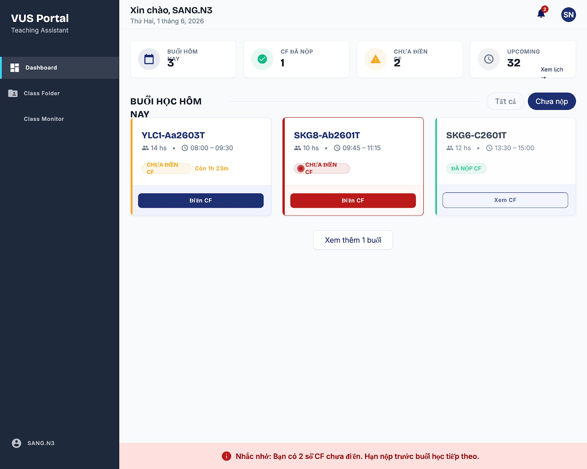
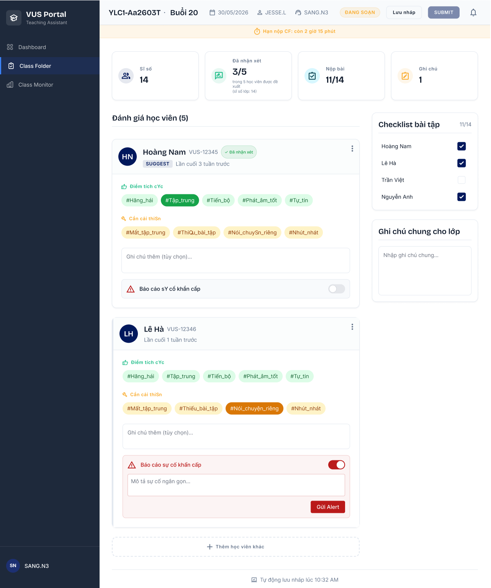
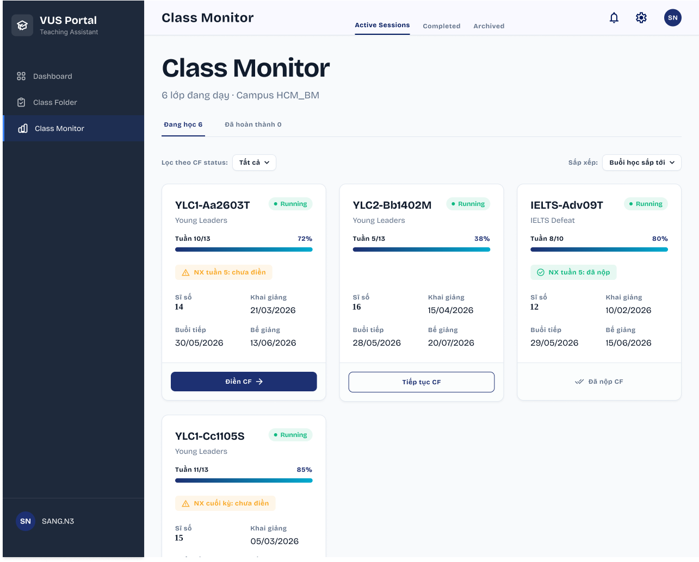
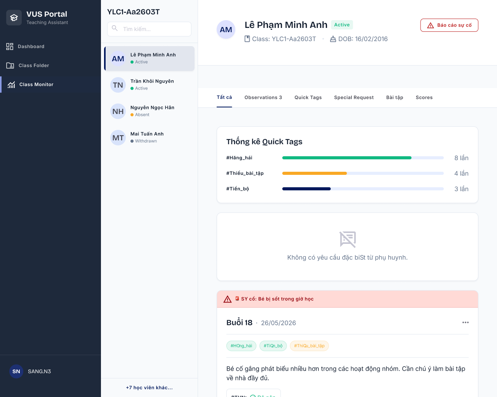
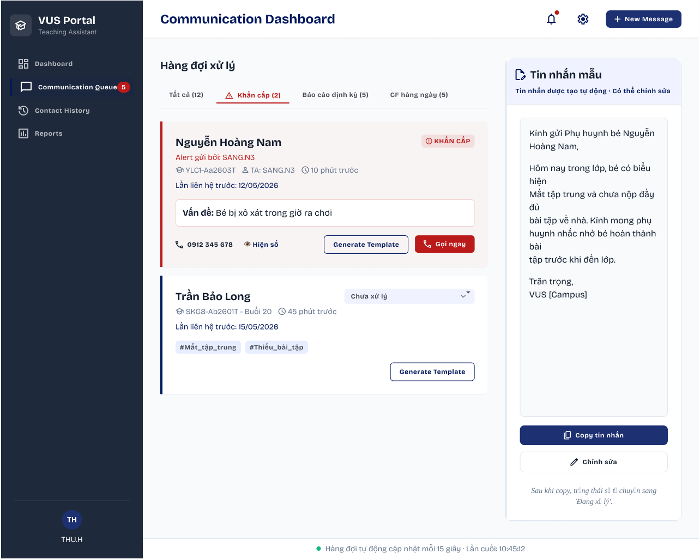

  

# Digital Class Folder (DCF) — BA Portfolio Project

Dự án **Số hóa "Sổ Đầu Bài" (Digital Class Folder)** cho trung tâm Anh ngữ — từ giai đoạn phân tích vấn đề đến thiết kế giao diện hoàn chỉnh, thể hiện quy trình làm việc thực tế của một Business Analyst.

---

## Vấn đề & Giải pháp

| | |
|---|---|
| **Vấn đề** | Trợ giảng (TA) ghi sổ bằng giấy hoặc Google Sheets phân tán — tốn > 15 phút/buổi, thông tin chậm đến Phụ huynh, không có dữ liệu để quản lý chất lượng |
| **Giải pháp** | Hệ thống **DCF Platform (VUS Portal)** với Quick Tags, Auto-Rotate Suggestion, Real-time Incident Alert và ASA Communication Queue |
| **Mục tiêu đo được** | Giảm 70% thời gian nhập liệu · Xử lý sự cố `< 2 giờ` · Tỷ lệ hoàn thành sổ `> 95%` |

---

## Lộ trình Dự án (4 Phases)

### Phase 1 — Feature Ideation & Scope
📄 [`docs/phase1-feature-ideation.md`](docs/phase1-feature-ideation.md)

Phân tích 10 tính năng tiềm năng theo ma trận Impact × Effort. Xác định 5 tính năng MVP, định nghĩa In-Scope/Out-of-Scope, và lập bảng Actor Table với 5 stakeholder chính (TA, ASA, Teacher, TQM, Hệ thống).

### Phase 2 — Business Process Flow
📄 [`docs/phase2-process-flow.md`](docs/phase2-process-flow.md)

Lập bản đồ quy trình As-Is (hiện trạng) và To-Be (đề xuất). Bao gồm BPMN Swimlane (TA ↔ System ↔ ASA ↔ Teacher ↔ TQM), Sequence Diagram cho luồng hàng ngày và báo cáo định kỳ W5/W10, đặc tả Auto-Rotate business logic.

> **Lưu ý:** Tất cả sơ đồ BPMN, Sequence Diagram và System Architecture được nhúng trực tiếp dưới dạng **Mermaid code** trong các file `.md` — GitHub tự render thành sơ đồ khi xem trực tuyến.

### Phase 3 — BRD & User Stories
📄 [`docs/phase3-brd-user-stories.md`](docs/phase3-brd-user-stories.md)

Tài liệu Business & Functional Requirements Document (BRD & FRD) đầy đủ gồm: Stakeholder Register, Business Case/ROI baseline, 5 Use Case Specifications (UC-CF-01 đến UC-CF-05), 4 User Stories theo chuẩn INVEST kèm Acceptance Criteria, và bảng NFR chi tiết.

### Phase 4 — UI/UX Prototype
📁 [`prototype/`](prototype/)

5 màn hình thiết kế dựa trên User Stories đã định nghĩa. Design System sử dụng: **Bricolage Grotesque** (heading) + **Inter** (body), sidebar navy `#1e293b`, primary `#1d3072`. Xem chi tiết tại [`prototype/README.md`](prototype/README.md).

**[Xem thiết kế trên Figma →](https://www.figma.com/design/1EEfOhjwVWJFDik4i4u5yf/Digital-CF?node-id=0-1&t=485Qb1yHpVVvYS0m-1)**

---

## Preview Giao diện

### TA Dashboard — Màn hình chính của Trợ giảng

### Class Folder Form — Nhập liệu với Quick Tags

### Class Monitor — Tổng quan các lớp đang dạy

### Student Profile — Hồ sơ & lịch sử nhận xét học viên

### ASA Communication Dashboard — Xử lý cảnh báo & liên hệ Phụ huynh

---

## Năng lực BA thể hiện trong dự án

| Kỹ năng | Bằng chứng cụ thể |
|---|---|
| **Requirements Elicitation** | Phân tích Pain-points → 5 tính năng MVP có đo lường ROI baseline |
| **Process Modeling** | BPMN Swimlane 5 actor, Sequence Diagram As-Is & To-Be |
| **BRD Documentation** | Stakeholder Register, Use Case Specs, NFR table, Version History, Sign-off |
| **Agile / User Stories** | 4 US theo INVEST, Acceptance Criteria 3 kịch bản (happy/edge/negative) |
| **UI/UX Translation** | 5 màn hình prototype nhất quán với Design System đã định nghĩa |
| **Version Control** | Git commit history thể hiện tư duy documentation theo milestone |

---

*Dự án hoàn thành tháng 6/2026.*
