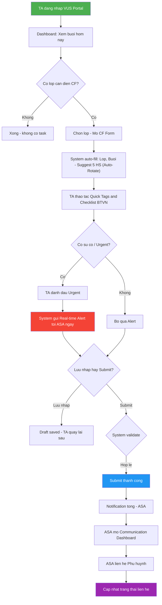
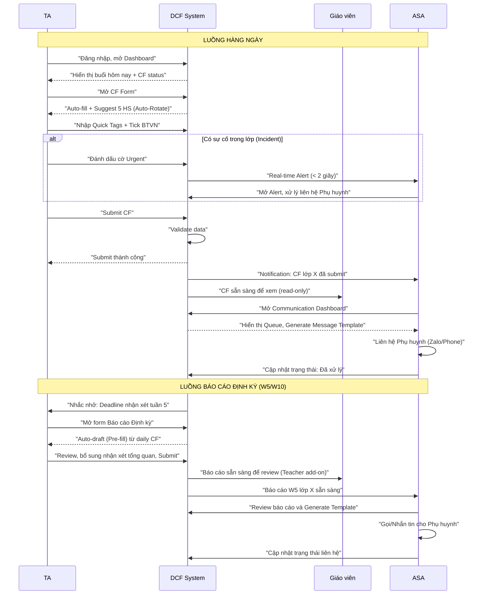
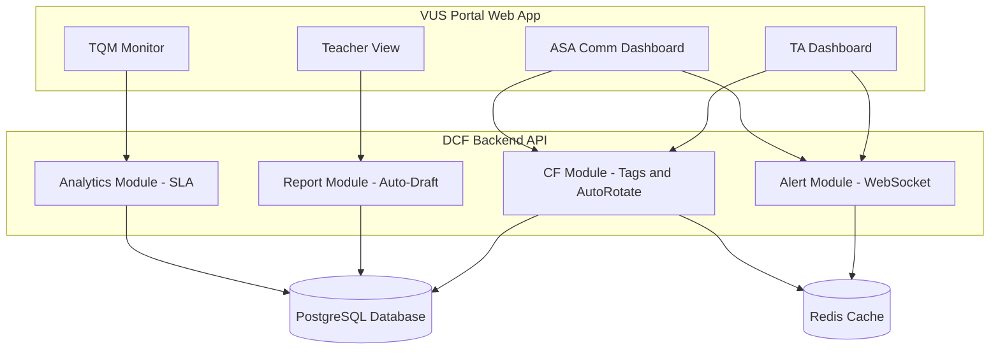

# Phase 2: Process Flow & System Architecture

> **Dự án:** Digital Class Folder (DCF)  
> **Ngày:** 2026-05-30  

---

## 1. Actors & Roles (Updated)

| Actor | Vai trò | Tương tác chính với DCF |
|---|---|---|
| **TA (Teaching Assistant)** | Người nhập liệu chính | Nhận xét hàng ngày (5 HS/buổi), tick BTVN, cảnh báo sự cố, viết báo cáo định kỳ W5/W10 |
| **Giáo viên (Teacher)** | Giáo viên VN & nước ngoài | Xem CF lớp mình, bổ sung nhận xét (Teacher note), xem báo cáo W5/W10 |
| **ASA (Academic Support Assistant)** | Truyền đạt thông tin đến PH | Nhận notification/Alert khi TA có sự cố khẩn hoặc nộp CF, generate tin nhắn mẫu từ Dashboard, liên hệ phụ huynh, cập nhật trạng thái |
| **TQM (Teaching Quality Management)** | Quản lý chất lượng giảng dạy | Giám sát tỉ lệ CF hoàn thành của TA, review chất lượng nhận xét, xem report tổng hợp toàn trung tâm |
| **Hệ thống (DCF Platform)** | Xử lý tự động | Auto-Rotate Suggest học viên, pre-fill báo cáo, push Real-time Incident Alert, nhắc nhở deadline |

---

## 2. Business Process Flow — Luồng nghiệp vụ chính

### 2.1 Luồng hàng ngày: TA nhập CF → ASA tiếp nhận & Cảnh báo sự cố

```text
TRƯỚC GIỜ DẠY
    │
    ▼
┌─────────────────────────────────────────────────────────┐
│ 1. TA đăng nhập VUS Portal → Mở Dashboard               │
│    System hiển thị: buổi hôm nay, CF đã/chưa nộp        │
└─────────────────────────────────────────────────────────┘
    │
    ▼
┌─────────────────────────────────────────────────────────┐
│ 2. TA chọn lớp cần điền CF (click "Điền CF")            │
│    System mở Class Folder Form, auto-fill:              │
│    - Tên lớp, buổi số, ngày, teacher, TA                │
│    - Sĩ số lớp                                          │
│    - 5 học viên suggest (Auto-Rotate Engine)            │
└─────────────────────────────────────────────────────────┘
    │
    ▼
SAU GIỜ DẠY
    │
    ▼
┌─────────────────────────────────────────────────────────┐
│ 3. TA nhập nhận xét cho từng học viên:                  │
│    - Chọn các Quick Tags (VD: #SôiNổi, #KémTậpTrung)    │
│    - Tick Checklist bài tập (☑ Đã nộp / ☐ Chưa nộp)     │
│    Option: [+ Thêm học viên khác] ngoài 5 suggest       │
└─────────────────────────────────────────────────────────┘
    │
    ▼
┌─────────────────────────────────────────────────────────┐
│ 4. Phân loại sự cố (Incident check)                     │
│    TA kiểm tra xem có học sinh vi phạm/sự cố không?     │
└─────────────────────────────────────────────────────────┘
    ├── [CÓ SỰ CỐ] ──→ TA cắm cờ "Urgent" / Tag #SựCố ──→ System lập tức GỬI REAL-TIME ALERT (Email/Notif) đến ASA
    │
    ▼
┌─────────────────────────────────────────────────────────┐
│ 5. TA click [SUBMIT]                                    │
│    System kiểm tra: đủ 5 nhận xét? BTVN đã tick hết?    │
│    ── Thiếu → cảnh báo, cho submit anyway               │
│    ── Đủ → Submit thành công                            │
│    ⚠️ Cảnh báo Deadline: Khóa form nếu quá giờ hạn nộp  │
└─────────────────────────────────────────────────────────┘
    │
    ▼
┌─────────────────────────────────────────────────────────┐
│ 6. System gửi notification (bình thường) cho ASA:       │
│    System đánh dấu: CF status = "Submitted"             │
│    Teacher có thể xem CF vừa submit (read-only)         │
└─────────────────────────────────────────────────────────┘
    │
    ▼
┌─────────────────────────────────────────────────────────┐
│ 7. ASA mở Communication Dashboard → xem danh sách       │
│    - Nếu có thẻ Urgent: Ưu tiên xử lý ngay lập tức      │
│    - Click "Generate Template" tạo tin nhắn mẫu         │
│    - Liên hệ Phụ huynh (Zalo/Call/Email)                │
│    - Cập nhật trạng thái "Đã gọi/Đã nhắn/Đã xử lý"      │
└─────────────────────────────────────────────────────────┘
```

### 2.2 Luồng báo cáo định kỳ (Tuần 5 & Tuần 10)

```text
DEADLINE REPORT SẮP ĐẾN
    │
    ▼
┌─────────────────────────────────────────────────────────┐
│ 1. System detect: Lớp X đã đến tuần 5 (hoặc tuần 10)    │
│    → Gửi nhắc nhở cho TA & TQM                          │
└─────────────────────────────────────────────────────────┘
    │
    ▼
┌─────────────────────────────────────────────────────────┐
│ 2. TA mở form Báo cáo Định kỳ                           │
│    System auto-draft (pre-fill) từ data hàng ngày:      │
│    - Tổng số buổi đã dạy, Điểm danh                     │
│    - Tỉ lệ BTVN                                         │
│    - Số lần được nhận xét, các tags phổ biến            │
└─────────────────────────────────────────────────────────┘
    │
    ▼
┌─────────────────────────────────────────────────────────┐
│ 3. TA review data pre-filled:                           │
│    - Chỉnh sửa/bổ sung nhận xét tổng quan               │
│    - Viết recommendation (khuyến nghị cho PH)           │
└─────────────────────────────────────────────────────────┘
    │
    ▼
┌─────────────────────────────────────────────────────────┐
│ 4. TA submit báo cáo                                    │
│    → Teacher xem trước (có thể add-on comment)          │
│    → System gửi notification cho ASA                    │
└─────────────────────────────────────────────────────────┘
    │
    ▼
┌─────────────────────────────────────────────────────────┐
│ 5. ASA nhận báo cáo → Dùng "Generate Template"          │
│    → Liên hệ PH & Cập nhật trạng thái                   │
└─────────────────────────────────────────────────────────┘
```

---

## 3. Mermaid Diagrams

### 3.1 Flowchart — Luồng hàng ngày (TA điền CF)



### 3.2 BPMN — Swimlane tổng quan (TA ↔ System ↔ ASA ↔ Teacher ↔ TQM)



---

## 4. Auto-Rotate & Suggestion Engine (Business Logic)

```text
Input:  Danh sách N học viên trong lớp (10-20 HS)
Output: 5 học viên được suggest cho buổi hôm nay

Quy tắc ưu tiên (Priority Score):
┌────────────────────────────────────────────────────┐
│ P1 (Cao nhất): HS có Cờ "Urgent/Cần Theo Dõi"      │
│    (Được Teacher/TA đánh dấu từ hôm trước)         │
│                                                    │
│ P2: HS chưa được nhận xét lần nào                  │
│    trong khóa hiện tại                             │
│                                                    │
│ P3: HS có khoảng cách nhận xét dài nhất            │
│    (VD: "Lần cuối: 4 tuần trước" > "2 tuần trước") │
│                                                    │
│ P4 (Thấp nhất): HS vừa được nhận xét gần đây       │
│    → đẩy xuống cuối hàng đợi                       │
└────────────────────────────────────────────────────┘

Constraint:
- Đảm bảo đến tuần 10, mọi HS đều có số lần nhận xét xấp xỉ nhau.
- Không suggest cùng 5 HS liên tục 2 buổi liền.
- TA vẫn có thể [+ Thêm HS khác] ngoài 5 suggest này.
```

---

## 5. System Architecture Overview (High-level)


