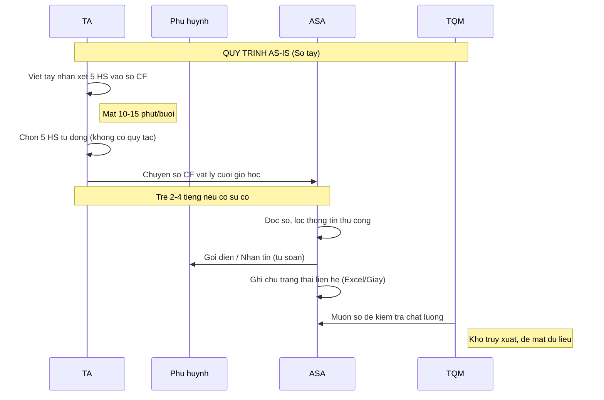
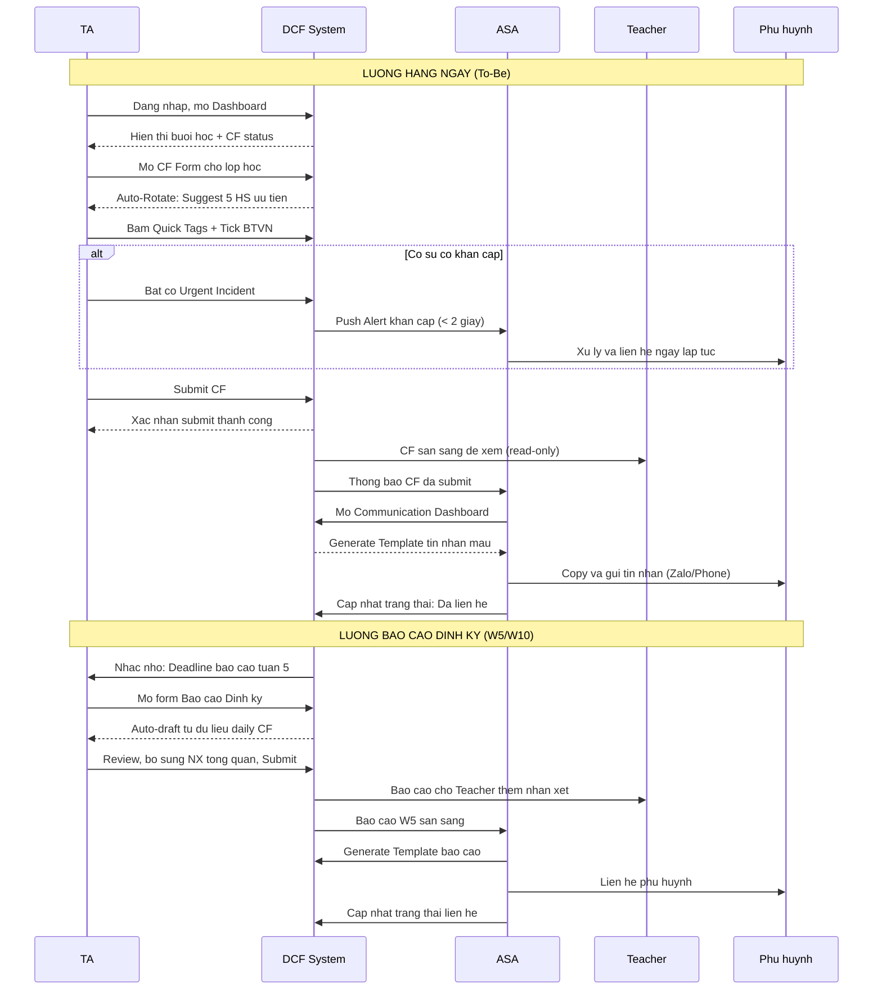
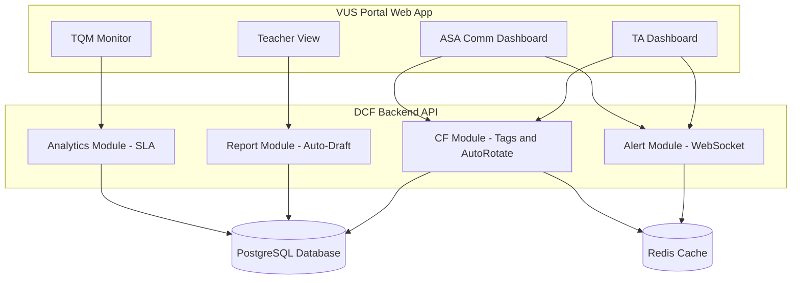

# Business & Functional Requirements Document (BRD & FRD)
**Project Name:** Digital Class Folder (Số hóa Sổ quản lý lớp học)
**Role:** Business Analyst (kiêm UI/UX Designer cho dự án cá nhân)

---

## Document Control
### Version History
| Version | Date | Author | Description of Change |
|---|---|---|---|
| 1.0 | 2026-05-30 | BA Team | Initial Draft - MVP Scope. |
| 1.1 | 2026-05-30 | BA Team | Added Stakeholder Register, Business Case, NFRs (Privacy, Scalability), TQM Use Case. |
| 1.2 | 2026-05-30 | BA Team | Removed invalid UML Use Case diagram, added INVEST self-check tables, Impact x Effort Matrix, and System Architecture Diagram. Unified Teacher terminology. |

### Sign-off
| Name | Role / Title | Signature | Date |
|---|---|---|---|
| [Name] | Project Sponsor | _________________ | ___/___/2026 |
| [Name] | Academic Director | _________________ | ___/___/2026 |
| [Name] | TQM Manager | _________________ | ___/___/2026 |

---

## 1. Tóm tắt điều hành (Executive Summary)
Dự án Digital Class Folder (DCF) nhằm số hóa quy trình ghi chép nhận xét học viên vào sổ vật lý tại trung tâm Tiếng Anh bằng nền tảng Web Application. Dự án tối ưu hóa năng suất cho Teaching Assistant (TA) thông qua Quick Tags và Auto-Rotate, tự động hóa cảnh báo sự cố khẩn cấp (Incident Alert) đến Academic Support Assistant (ASA) nhằm tăng cường tốc độ liên lạc với phụ huynh, đồng thời cung cấp công cụ giám sát trực quan cho Giáo viên (Teacher) và Quản lý chất lượng giảng dạy (TQM).

## 2. Mô tả dự án
### 2.1 Vấn đề hiện tại (As-Is Pain Points)
- Việc ghi chép nhận xét 5 học viên/buổi bằng tay tốn thời gian, chữ khó đọc, khó tra cứu.
- Các sự cố trong lớp (học viên bệnh, xô xát) chỉ được báo cáo khi nộp sổ cuối giờ, khiến ASA xử lý trễ.
- Khó tổng hợp thông tin rời rạc để làm báo cáo cuối kỳ tuần 5/10.
- Thiếu logic nhắc nhở, TA dễ bỏ sót hoặc nhận xét trùng lặp học viên.

### 2.2 Mục tiêu dự án (To-Be Goals)
- Số hóa 100% quy trình nhập liệu của TA (nhận xét, bài tập, báo cáo).
- Giảm 70-80% thời gian nhập liệu của TA mỗi buổi học bằng Quick Tags.
- Đảm bảo 100% học viên được nhận xét công bằng qua thuật toán Auto-Rotate.
- Cảnh báo tức thời (Real-time Alert) cho ASA xử lý nhanh các sự cố khẩn cấp.

### 2.3 Phân tích Bên liên quan (Stakeholder Register)
| Nhóm Stakeholder | Vai trò | Mức độ quan tâm | Mức độ ảnh hưởng | Kỳ vọng chính |
|---|---|---|---|---|
| **Ban Giám Đốc (Sponsor)** | Phê duyệt dự án & ngân sách | Cao | Cao | Tối ưu chi phí vận hành (in ấn sổ), nâng cao chất lượng dịch vụ CSKH. |
| **Quản lý chất lượng (TQM)** | Giám sát chất lượng giảng dạy | Cao | Cao | Có Dashboard trực quan để tracking tỷ lệ hoàn thành sổ, giảm thời gian audit thủ công. |
| **Trợ lý học vụ (ASA)** | Tương tác trực tiếp phụ huynh | Cao | Trung bình | Nhận cảnh báo sự cố sớm, lấy dữ liệu nhanh chóng để liên hệ phụ huynh. |
| **Trợ giảng (TA)** | Người dùng chính (End-user) | Cao | Trung bình | Ứng dụng dễ dùng trên điện thoại, giảm thiểu thời gian gõ chữ, không lo trễ giờ. |
| **Giáo viên (Teacher)** | Người dùng phụ | Trung bình | Trung bình | Nắm bắt tình hình lớp học dễ dàng, thêm nhận xét (add-on) nhanh chóng. |
| **Phụ huynh (Parents)** | Người bị ảnh hưởng gián tiếp | Cao | Thấp | Nhận thông tin về con em nhanh chóng, minh bạch và chuyên nghiệp. |

### 2.4 Business Case & ROI (Cơ sở đo lường)
*Baseline (Giả định dựa trên khảo sát thực tế 3 TA và 2 ASA):*
- **As-Is (Hiện tại):** Một TA mất trung bình 10-15 phút cuối giờ để viết tay nhận xét cho 5 học viên. Khi có sự cố, thời gian ASA nhận được thông tin thường trễ 2-4 tiếng do phải đợi ca học kết thúc và TA mang sổ xuống văn phòng.
- **To-Be (Kỳ vọng):** Giảm 70-80% thời gian nhập liệu (chỉ còn 2-3 phút/buổi) nhờ hệ thống Quick Tags. Rút ngắn thời gian tiếp nhận sự cố khẩn cấp từ vài tiếng xuống dưới 2 phút (nhờ Push Notification thời gian thực).

---

## 3. Phạm vi dự án
### 3.1 Trong phạm vi (In Scope - MVP)
- Hệ thống Gợi ý học viên hàng ngày (Auto-Rotate & Suggestion Engine).
- Nhập liệu bằng thẻ dán nhanh (Quick Tags & Snippets).
- Cảnh báo sự cố tức thời (Real-time Incident Alert).
- Tự động sinh báo cáo định kỳ (Auto-Draft Periodic Reports).
- Bảng điều khiển liên lạc cho ASA (ASA Communication Dashboard).
- Dashboard kiểm soát cho TQM (TQM Monitor Dashboard).
- Khóa tính năng nộp CF nếu trễ hạn (Strict Deadline Enforcement).

### 3.2 Ngoài phạm vi (Out of Scope - Theo dõi cho Phase tiếp theo)
- Tích hợp cổng trực tuyến xem điểm/nhận xét (Parent Portal) cho Phụ huynh.
- Tự động sinh nhận xét văn bản mềm mại từ các Tag bằng công nghệ AI sinh tạo.

---

## 4. Động lực kinh doanh (Business Drivers)
- **Tối ưu chi phí & Nguồn lực**: Giải quyết lãng phí sổ giấy, giảm bớt chi phí vận hành.
- **Tăng cường Chất lượng Dịch vụ**: Giảm độ trễ phản hồi khi có sự cố, tăng độ hài lòng và tỷ lệ tái đăng ký học.
- **Tính Minh bạch & Dễ kiểm soát**: Quản lý SLA hoàn thành công việc của đội ngũ TA và ASA.

---

## 5. Quy trình nghiệp vụ & Kiến trúc (Business Process & Architecture)
### 5.1 Đánh giá ưu tiên tính năng (Impact x Effort Matrix)
Việc lựa chọn các tính năng vào MVP dựa trên ma trận Impact x Effort:

| Tính năng | Impact (Tác động) | Effort (Công sức) | Nhóm |
|---|---|---|---|
| Quick Tags | Rất Cao | Thấp | **Quick Win** — MVP |
| Auto-Rotate | Cao | Trung bình | **Quick Win** — MVP |
| Auto-draft Report | Cao | Thấp | **Quick Win** — MVP |
| TQM Dashboard | Cao | Trung bình | **Major Project** — MVP |
| Real-time Alert | Rất Cao | Cao | **Major Project** — MVP |
| Parent Portal | Rất Cao | Rất Cao | **Major Project** — Post-MVP |
| AI Comment Gen | Trung bình | Rất Cao | **Thankless Task** — Post-MVP |

### 5.2 Quy trình hiện tại (As-Is)
TA nhận sổ CF vật lý, ghi chép bằng tay cuối giờ, rồi chuyển cho ASA. ASA nhận sổ, lọc thông tin và gọi điện. TQM rà soát ngẫu nhiên sổ để kiểm tra. Quy trình này rời rạc và tốn nhiều thời gian chuyển giao vật lý.

### 5.3 Quy trình đề xuất (To-Be)
TA truy cập Web App, hệ thống auto điền 5 tên học viên. TA thao tác bấm Quick Tags và tick checklist, sau đó Submit. Nếu có sự cố (bật cờ Urgent), hệ thống push alert ngay cho ASA. ASA truy cập Communication Dashboard, sử dụng tính năng "Generate Template" lấy tin nhắn gửi Zalo/Phone ngay lập tức và cập nhật trạng thái. Báo cáo định kỳ được hệ thống tự động nháp sẵn dựa trên dữ liệu hàng ngày.

### 5.4 Kiến trúc hệ thống (System Architecture)

---

## 6. Yêu cầu chức năng (Functional Requirements)
1. **Quản lý CF (TA Module)**: Hiển thị danh sách lớp, gợi ý 5 HS, Checkbox BTVN. Hỗ trợ nhập Quick Tags và bật cờ Urgent.
2. **Kiểm soát Hạn chót (System)**: Tự động khóa tính năng điền CF của buổi hiện tại nếu đã qua giờ bắt đầu của buổi học tiếp theo.
3. **Phê duyệt & Đóng góp (Teacher)**: Quyền xem toàn bộ CF lớp mình dạy, thêm nhận xét (Add-on Teacher Note).
4. **Quản lý Thông tin (ASA Module)**: Hàng đợi (Queue) hiển thị các CF/Alert, nút Generate Template sinh tin nhắn mẫu, cập nhật trạng thái liên hệ.
5. **Dashboard Kiểm Soát (TQM Module)**: Biểu đồ trực quan danh sách lớp chưa nộp CF, các TA có tỷ lệ nộp trễ cao, lấy mẫu ngẫu nhiên (sampling) để kiểm tra chất lượng ghi chép.

---

## 7. Yêu cầu phi chức năng (Non-Functional Requirements)
- **Hiệu suất & Tính khả dụng (Performance & Availability)**: 
  - Hệ thống phải đảm bảo uptime SLA 99.9% trong khung giờ hoạt động của trung tâm (8:00 AM - 10:00 PM).
  - Tốc độ tải Dashboard và submit form dưới 2 giây. Hỗ trợ tối đa 500 concurrent users (TA) submit sổ cùng lúc vào giờ cao điểm kết thúc ca học.
- **Khả năng mở rộng (Scalability)**: Kiến trúc Backend phải cho phép scale theo chiều ngang dễ dàng khi mở rộng số lượng chi nhánh trung tâm trên toàn quốc.
- **Bảo mật & Quyền riêng tư (Privacy & Compliance)**:
  - Tuân thủ Luật An ninh mạng Việt Nam và Nghị định 13/2023/NĐ-CP về Bảo vệ dữ liệu cá nhân (PDPA). Dữ liệu học sinh (tên, số điện thoại phụ huynh, tình trạng tâm lý/sức khỏe) là dữ liệu nhạy cảm, bắt buộc mã hóa (encrypted) khi lưu trữ ở database và truyền tải (HTTPS).
  - Áp dụng phân quyền nghiêm ngặt (Data isolation): TA chỉ xem được dữ liệu lớp mình dạy.
- **Chính sách lưu trữ dữ liệu (Data Retention Policy)**:
  - Dữ liệu Class Folder của một khóa học được giữ "Active" trong suốt 12-13 tuần.
  - Sau khi khóa học kết thúc, dữ liệu được chuyển sang trạng thái "Archived" trong 2 năm phục vụ tra cứu, sau đó tự động xóa (Purge) để giải phóng tài nguyên.
- **Thiết bị (Device Compatibility)**: Giao diện Mobile-first cho TA thao tác trong lớp, và Desktop-first cho ASA/TQM/Teacher.

---

## 8. Đặc tả Use Case (Use Case Specifications)

*(Sơ đồ Use Case Diagram không chuẩn UML đã được gỡ bỏ theo phản hồi chuyên môn. Các tương tác được thay thế bằng Sơ đồ Kiến trúc và luồng BPMN trong tài liệu tham khảo riêng.)*

### Chi tiết Use Case
*Được viết theo chuẩn 13 trường của Karl Wiegers, sử dụng thuật ngữ tiếng Việt chuyên ngành BA.*

| **Mã Use Case:** | UC-CF-01 |
|---|---|
| **Tên Use Case:** | Nhập Sổ lớp học hàng ngày (Submit Daily Class Folder) |
| **Người tạo:** | BA Team | **Cập nhật lần cuối:** | BA Team |
| **Tác nhân (Actor):** | **Chính (Primary):** Trợ giảng (TA)   **Phụ (Secondary):** Hệ thống |
| **Mô tả:** | TA ghi nhận trạng thái hoàn thành bài tập và các thẻ đánh giá hành vi cho 5 học viên được hệ thống tự động gợi ý sau mỗi buổi học. |
| **Tiền điều kiện:** | 1. TA đã đăng nhập thành công vào hệ thống.  2. Buổi học đã kết thúc và chưa vượt quá thời hạn nộp sổ (strict deadline). |
| **Hậu điều kiện:** | Dữ liệu đánh giá của 5 học viên được lưu thành công vào cơ sở dữ liệu. |
| **Mức độ ưu tiên:** | Cao (High) |
| **Tần suất sử dụng:** | 1 lần / buổi học / TA. |
| **Luồng sự kiện chính:** | 1. TA chọn lớp học từ màn hình Dashboard.  2. Hệ thống hiển thị 5 học viên được gợi ý dựa trên thuật toán Auto-Rotate.  3. TA click vào một học viên để mở form đánh giá.  4. Hệ thống hiển thị các checkbox bài tập và danh mục Quick Tags.  5. TA chọn các thẻ phù hợp và tick trạng thái bài tập.  6. TA bấm "Nộp sổ" (Submit).  7. Hệ thống kiểm tra tính hợp lệ của dữ liệu và lưu vào DB.  8. Hệ thống hiển thị thông báo thành công. |
| **Luồng thay thế:** | **UC-CF-01.AC.1:** Tại bước 3, TA bấm "Gỡ bỏ" một học viên trong danh sách gợi ý và chủ động chọn một học viên khác từ danh sách tổng của lớp. |
| **Ngoại lệ:** | **UC-CF-01.EX.1 (Thiếu dữ liệu):** Tại bước 7, nếu TA chưa chọn bất kỳ Thẻ nào, hệ thống sẽ chặn thao tác submit và bôi đỏ khu vực bị thiếu.  **UC-CF-01.EX.2 (Quá hạn nộp sổ):** Tại bước 7, nếu thời gian nộp sổ vừa hết hạn, hệ thống từ chối dữ liệu và khóa form sang chế độ chỉ xem (read-only). |
| **Bao gồm (Includes):** | N/A |
| **Yêu cầu đặc biệt:** | Giao diện phải phản hồi mượt mà trên di động khi chạm chọn thẻ (lag < 1s). |
| **Giả định:** | TA có kết nối mạng ổn định tại lớp học sau ca dạy. |
| **Ghi chú & Vấn đề:** | N/A |

 

| **Mã Use Case:** | UC-CF-02 |
|---|---|
| **Tên Use Case:** | Báo cáo sự cố khẩn cấp (Report Urgent Incident) |
| **Người tạo:** | BA Team | **Cập nhật lần cuối:** | BA Team |
| **Tác nhân (Actor):** | **Chính (Primary):** Trợ giảng (TA)   **Phụ (Secondary):** Trợ lý học vụ (ASA) |
| **Mô tả:** | TA gắn cờ báo cáo sự cố nghiêm trọng (VD: xô xát, ốm) khi điền nhận xét, kích hoạt hệ thống gửi cảnh báo thời gian thực đến ASA. |
| **Tiền điều kiện:** | TA đang ở giao diện điền form đánh giá của một học viên cụ thể (trong UC-CF-01). |
| **Hậu điều kiện:** | Bản ghi sự cố được lưu và thông báo đẩy (push notification) được chuyển trực tiếp đến Dashboard của ASA. |
| **Mức độ ưu tiên:** | Cao (High) |
| **Tần suất sử dụng:** | Tùy tình huống phát sinh (Ít nhưng nghiêm trọng). |
| **Luồng sự kiện chính:** | 1. TA chọn một Quick Tag mang tính cảnh báo (VD: #XôXát, #ỐmĐau).  2. TA bật công tắc "Sự cố khẩn cấp" (Urgent Incident).  3. TA nhập thêm chi tiết vào ô mô tả văn bản.  4. TA bấm "Gửi cảnh báo" (Send Alert).  5. Hệ thống lưu bản ghi sự cố này (không cần đợi nộp toàn bộ Sổ lớp).  6. Hệ thống đẩy một cảnh báo thời gian thực đến ASA.  7. Hệ thống đưa TA quay trở lại luồng đánh giá hàng ngày. |
| **Luồng thay thế:** | N/A |
| **Ngoại lệ:** | **UC-CF-02.EX.1 (Lỗi kết nối):** Tại bước 5, nếu thiết bị mất kết nối, hệ thống lưu cảnh báo vào local cache và tự động gửi khi có mạng. |
| **Bao gồm (Includes):** | N/A |
| **Yêu cầu đặc biệt:** | Thông báo đẩy phải xuất hiện trên Dashboard của ASA trong tối đa 2 giây. |
| **Giả định:** | ASA luôn trực Dashboard giao tiếp trong khung giờ làm việc. |
| **Ghi chú & Vấn đề:** | Use Case này mở rộng (extends) từ UC-CF-01. |

 

| **Mã Use Case:** | UC-CF-03 |
|---|---|
| **Tên Use Case:** | Nộp báo cáo định kỳ (Submit Periodic Report) |
| **Người tạo:** | BA Team | **Cập nhật lần cuối:** | BA Team |
| **Tác nhân (Actor):** | **Chính (Primary):** Trợ giảng (TA)   **Phụ (Secondary):** Giáo viên (Teacher) |
| **Mô tả:** | TA rà soát lại bảng dữ liệu được tổng hợp tự động cho giai đoạn tuần 1-5 (hoặc 6-10), bổ sung định hướng chung và nộp báo cáo. |
| **Tiền điều kiện:** | Lớp học đã hoàn thành tuần 5 hoặc 10. Toàn bộ Sổ lớp hàng ngày giai đoạn trước đã được nộp. |
| **Hậu điều kiện:** | Báo cáo định kỳ được lưu vào hệ thống và chờ Giáo viên duyệt. |
| **Mức độ ưu tiên:** | Trung bình (Medium) |
| **Tần suất sử dụng:** | 2 lần / khóa học / lớp. |
| **Luồng sự kiện chính:** | 1. TA bấm vào "Báo cáo định kỳ" trên Dashboard.  2. Hệ thống tự động điền số liệu tổng hợp (chuyên cần, % bài tập, Tag xuất hiện nhiều).  3. TA rà soát lại dữ liệu.  4. TA nhập lời khuyên/định hướng chung vào ô văn bản.  5. TA bấm "Nộp báo cáo".  6. Hệ thống chuyển trạng thái báo cáo thành "Chờ duyệt". |
| **Luồng thay thế:** | **UC-CF-03.AC.1:** Sau bước 6, Giáo viên xem báo cáo và nhập thêm "Nhận xét của Giáo viên". Nội dung này được ghép vào báo cáo cuối cùng. |
| **Ngoại lệ:** | **UC-CF-03.EX.1:** Tại bước 5, nếu ô lời khuyên trống, hệ thống chặn submit. |
| **Bao gồm (Includes):** | N/A |
| **Yêu cầu đặc biệt:** | Batch job tổng hợp dữ liệu không làm khóa database (database locks). |
| **Giả định:** | N/A |
| **Ghi chú & Vấn đề:** | N/A |

 

| **Mã Use Case:** | UC-CF-04 |
|---|---|
| **Tên Use Case:** | Xử lý thông tin liên lạc Phụ huynh (Process Parent Communication) |
| **Người tạo:** | BA Team | **Cập nhật lần cuối:** | BA Team |
| **Tác nhân (Actor):** | **Chính (Primary):** Trợ lý học vụ (ASA) |
| **Mô tả:** | ASA tiếp nhận báo cáo định kỳ/cảnh báo, dùng hệ thống sinh tin nhắn mẫu và cập nhật trạng thái liên lạc. |
| **Tiền điều kiện:** | Có hạng mục chờ xử lý trong hàng đợi của ASA. |
| **Hậu điều kiện:** | Trạng thái hạng mục cập nhật thành "Đã liên hệ" kèm timestamp. |
| **Mức độ ưu tiên:** | Cao (High) |
| **Tần suất sử dụng:** | Liên tục nhiều lần trong ngày. |
| **Luồng sự kiện chính:** | 1. ASA mở Communication Dashboard.  2. Hệ thống hiển thị hàng đợi, đẩy các cảnh báo "Khẩn cấp" lên trên cùng.  3. ASA bấm vào mục chờ để xem chi tiết.  4. ASA bấm "Generate Template".  5. Hệ thống tự biên dịch dữ liệu từ Quick Tags thành văn bản hoàn chỉnh.  6. ASA copy văn bản và liên hệ phụ huynh qua Zalo/Điện thoại.  7. ASA chuyển trạng thái thành "Đã liên hệ".  8. Hệ thống gỡ mục này khỏi hàng đợi. |
| **Luồng thay thế:** | **UC-CF-04.AC.1:** Tại bước 7, ASA chuyển trạng thái thành "Tạm hoãn - Không bắt máy". Hệ thống đẩy mục này xuống cuối hàng đợi và nhắc nhở gọi lại sau 4 tiếng. |
| **Ngoại lệ:** | **UC-CF-04.EX.1:** Tại bước 7, nếu ASA khác đã xử lý mục này, hệ thống báo lỗi xung đột và tự động làm mới hàng đợi. |
| **Bao gồm (Includes):** | N/A |
| **Yêu cầu đặc biệt:** | Hàng đợi auto-refresh mỗi 15s. |
| **Giả định:** | ASA sử dụng Zalo PC, IP Phone ngoài hệ thống để liên lạc. |
| **Ghi chú & Vấn đề:** | N/A |

 

| **Mã Use Case:** | UC-CF-05 |
|---|---|
| **Tên Use Case:** | Giám sát Dashboard chất lượng (Monitor TQM Dashboard) |
| **Người tạo:** | BA Team | **Cập nhật lần cuối:** | BA Team |
| **Tác nhân (Actor):** | **Chính (Primary):** Quản lý chất lượng (TQM) |
| **Mô tả:** | TQM theo dõi tỷ lệ hoàn thành sổ lớp của TA, xem thống kê sự cố và lấy mẫu (sampling) kiểm tra chất lượng ghi chép ngẫu nhiên. |
| **Tiền điều kiện:** | TQM đã đăng nhập thành công với quyền truy cập Analytics. |
| **Hậu điều kiện:** | TQM xuất được báo cáo đánh giá hoặc lưu ý các lớp vi phạm SLA. |
| **Mức độ ưu tiên:** | Trung bình (Medium) |
| **Tần suất sử dụng:** | Hàng ngày hoặc hàng tuần. |
| **Luồng sự kiện chính:** | 1. TQM mở Dashboard Quản lý chất lượng.  2. Hệ thống hiển thị biểu đồ tỷ lệ TA nộp sổ đúng hạn/trễ hạn trên toàn cơ sở.  3. TQM lọc dữ liệu theo cơ sở (branch) hoặc theo khoảng thời gian.  4. TQM bấm vào một lớp học bị đánh dấu cờ đỏ (nhiều sự cố hoặc nộp trễ nhiều).  5. Hệ thống liệt kê chi tiết các Sổ lớp của lớp đó để TQM kiểm tra nội dung (audit). |
| **Luồng thay thế:** | N/A |
| **Ngoại lệ:** | N/A |
| **Bao gồm (Includes):** | N/A |
| **Yêu cầu đặc biệt:** | Biểu đồ phải load đủ số liệu của 1 tháng trong vòng dưới 3 giây. |
| **Giả định:** | N/A |
| **Ghi chú & Vấn đề:** | N/A |

---

## 9. Phân rã User Stories (Kèm Acceptance Criteria)
*Áp dụng chuẩn INVEST và cấu trúc Gherkin (Given-When-Then).*

### **US-01**: Tự động gợi ý học viên (Auto-Rotate)
**As a** Trợ giảng (Teaching Assistant)  
**I want to** nhận được danh sách 5 học viên gợi ý tự động từ hệ thống mỗi ngày  
**So that** tôi không phải mất thời gian chọn lọc và đảm bảo tất cả học viên đều được nhận xét công bằng.

**Kiểm tra INVEST:**
| Tiêu chí | Đánh giá | Giải thích |
|---|---|---|
| **I**ndependent | ✅ Có | Tính năng Auto-Rotate hoạt động độc lập, không phụ thuộc vào trạng thái Sổ lớp của ngày trước đó. |
| **N**egotiable | ✅ Có | Thuật toán có thể đàm phán thay đổi để ưu tiên học viên có cờ báo động. |
| **V**aluable | ✅ Có | Giúp TA tiết kiệm thời gian chọn lọc và đảm bảo tính công bằng 100%. |
| **E**stimable | ✅ Có | Logic query DB theo timestamp khá rõ ràng, dễ ước lượng nỗ lực. |
| **S**mall | ✅ Có | Phạm vi giới hạn ở việc hiển thị 5 học viên trên UI. |
| **T**estable | ✅ Có | Dễ dàng viết unit test cho hàm query và test UI/UX. |

**Acceptance Criteria:**
- **AC1 (Happy path):**
  - **Given** Lớp có 15 học viên và chưa ai được nhận xét trong buổi hôm nay
  - **When** TA mở form điền CF
  - **Then** hệ thống hiển thị chính xác 5 học viên có khoảng thời gian từ lần nhận xét cuối cùng là dài nhất
  - **And** không hiển thị học viên nào vừa được nhận xét ở ngay ca liền trước.
- **AC2 (Edge case - Cờ ưu tiên):**
  - **Given** Học sinh "Minh" vừa bị Giáo viên gắn cờ "Cần theo dõi sát"
  - **When** thuật toán Auto-Rotate chạy
  - **Then** "Minh" phải được ưu tiên xuất hiện trong danh sách 5 người bất chấp thời gian nhận xét cuối.
- **AC3 (Negative path - Lớp ít học viên):**
  - **Given** Lớp học hiện tại chỉ có 3 học viên
  - **When** TA mở form điền CF
  - **Then** hệ thống chỉ hiển thị 3 học viên
  - **And** không báo lỗi chặn validation "Bắt buộc điền đủ 5".

### **US-02**: Nhập liệu bằng Quick Tags
**As a** Trợ giảng (Teaching Assistant)  
**I want to** chọn các thẻ đánh giá nhanh (Quick Tags) cho hành vi và bài tập  
**So that** tôi có thể hoàn thành việc đánh giá trong 1-2 phút mà không cần phải gõ bàn phím dài dòng.

**Kiểm tra INVEST:**
| Tiêu chí | Đánh giá | Giải thích |
|---|---|---|
| **I**ndependent | ✅ Có | Không phụ thuộc vào thuật toán chọn học viên. |
| **N**egotiable | ✅ Có | Giao diện và màu sắc các tag có thể tinh chỉnh sau. |
| **V**aluable | ✅ Có | Giải quyết pain point cốt lõi là việc gõ phím quá nhiều. |
| **E**stimable | ✅ Có | CRUD cơ bản cho tags, ước lượng effort thấp. |
| **S**mall | ✅ Có | Chỉ xoay quanh giao diện chạm để chọn tag. |
| **T**estable | ✅ Có | Kiểm thử dễ dàng qua các trường hợp thiếu/đủ tag. |

**Acceptance Criteria:**
- **AC1 (Happy path):**
  - **Given** TA đang ở màn hình nhận xét
  - **When** TA tap chọn tag "#Hăng_hái", tick trạng thái "Đủ bài tập" và bấm "Submit"
  - **Then** hệ thống lưu dữ liệu thành công vào DB và hiển thị Toast "Đã lưu".
- **AC2 (Edge case - Hủy chọn tag):**
  - **Given** TA lỡ tay chọn nhầm tag "#Mất_tập_trung"
  - **When** TA tap lại vào tag đó một lần nữa
  - **Then** hệ thống bỏ chọn (deselect) tag và màu sắc trở về xám mặc định.
- **AC3 (Negative path - Thiếu dữ liệu):**
  - **Given** TA đang ở màn hình nhận xét
  - **When** TA không chọn bất kỳ Quick Tag nào mà trực tiếp bấm "Submit"
  - **Then** hệ thống chặn API call và hiển thị lỗi màu đỏ "Vui lòng chọn ít nhất 1 thẻ đánh giá".

### **US-03**: Cảnh báo sự cố tức thời (Real-time Alert)
**As a** Trợ giảng (Teaching Assistant)  
**I want to** đánh dấu một học viên đang có sự cố khẩn cấp ngay trong form  
**So that** bộ phận ASA nhận được cảnh báo ngay lập tức để xử lý thay vì phải đợi tôi nộp toàn bộ sổ.

**Kiểm tra INVEST:**
| Tiêu chí | Đánh giá | Giải thích |
|---|---|---|
| **I**ndependent | ✅ Có | Tách biệt với luồng lưu Sổ lớp thông thường. |
| **N**egotiable | ✅ Có | Có thể thay thế WebSocket bằng Polling nếu chi phí server cao. |
| **V**aluable | ✅ Có | Cải thiện tốc độ phản ứng với phụ huynh, tăng CSAT. |
| **E**stimable | ✅ Có | Cần effort rõ ràng để setup WebSocket/Redis. |
| **S**mall | ✅ Có | Chỉ bao gồm thao tác bật cờ và push notification. |
| **T**estable | ✅ Có | Giả lập mất mạng và multi-session test khá khả thi. |

**Acceptance Criteria:**
- **AC1 (Happy path):**
  - **Given** TA đang điền form cho học viên bị ốm
  - **When** TA bật toggle "Cảnh báo khẩn cấp (Urgent)" và bấm "Gửi Alert"
  - **Then** hệ thống push Notification qua Web Socket đến Dashboard của ASA và gắn nhãn [URGENT].
- **AC2 (Edge case - Đính kèm thông tin):**
  - **Given** hệ thống chuẩn bị gửi Email cảnh báo
  - **When** trigger cảnh báo được kích hoạt
  - **Then** nội dung tự động đính kèm SĐT phụ huynh và Tên lớp để ASA không phải tra cứu lại CRM.
- **AC3 (Negative path - Mất mạng):**
  - **Given** Thiết bị bị rớt mạng
  - **When** TA bấm "Gửi Alert"
  - **Then** hệ thống lưu tạm vào Local Storage và hiển thị "Cảnh báo sẽ được tự động gửi khi có kết nối lại".

### **US-04**: Sinh tin nhắn mẫu cho ASA (Generate Template)
**As a** Trợ lý Học vụ (Academic Support Assistant)  
**I want to** bấm nút sinh tin nhắn từ Dashboard  
**So that** tôi có ngay một đoạn văn bản chỉn chu để copy-paste gửi cho phụ huynh mà không cần tự soạn lời.

**Kiểm tra INVEST:**
| Tiêu chí | Đánh giá | Giải thích |
|---|---|---|
| **I**ndependent | ✅ Có | Hoạt động dựa trên data có sẵn, không phụ thuộc hệ thống khác. |
| **N**egotiable | ✅ Có | Format tin nhắn có thể thay đổi tùy chiến dịch Marketing. |
| **V**aluable | ✅ Có | Rút ngắn thời gian xử lý của ASA từ vài phút xuống còn vài giây. |
| **E**stimable | ✅ Có | Logic map Text với Tag rất đơn giản. |
| **S**mall | ✅ Có | Chỉ là tính năng sinh văn bản tĩnh tại Frontend. |
| **T**estable | ✅ Có | Test các tổ hợp Tag khác nhau xem văn bản sinh ra có đúng logic không. |

**Acceptance Criteria:**
- **AC1 (Happy path):**
  - **Given** ASA đang xem thẻ báo cáo chứa tag "#Hăng_hái" và BTVN="Đã nộp"
  - **When** ASA nhấn "Generate Template"
  - **Then** hệ thống hiển thị popup: "Kính gửi Phụ huynh, hôm nay bé Hăng hái và nộp đủ bài..." kèm nút Copy.
- **AC2 (Edge case - Đổi trạng thái tự động):**
  - **Given** ASA đang ở popup tin nhắn mẫu
  - **When** ASA bấm nút "Copy to Clipboard"
  - **Then** hệ thống tự động đổi trạng thái thẻ báo cáo đó thành "Đang xử lý".
- **AC3 (Negative path - Tag chưa được cấu hình):**
  - **Given** Hệ thống chưa được cấu hình map chữ cho tag mới "#Khóc_nhè"
  - **When** ASA bấm "Generate Template"
  - **Then** hệ thống sinh template nhưng chừa trống phần đó `[...]` và hiển thị tooltip nhắc nhở tự điền.

---

## 10. Nguồn lực và Timeline (MVP)
- **Nguồn lực**: 1 Project Manager/BA, 1 UI/UX Designer, 2 Fullstack Developers, 1 QA/QC.
- **Timeline ước tính**: 2 tháng *(Lưu ý: Thời gian này dựa trên giả định team làm việc full-time 100%, không tính thời gian onboarding nhân sự và các khâu phê duyệt kéo dài).*
  - Tuần 1-2: Phân tích yêu cầu & Thiết kế Wireframes/UI.
  - Tuần 3-6: Phát triển tính năng (Development).
  - Tuần 7: Kiểm thử (UAT).
  - Tuần 8: Go-live & Đào tạo người dùng (Training).

## 11. Giả định và Rủi ro (Assumptions & Risks)
- **Giả định**: TA có thiết bị cá nhân (smartphone/tablet) và kết nối internet ổn định tại lớp học để sử dụng Web App. ASA luôn theo dõi Dashboard trong giờ hành chính.
- **Rủi ro**: 
  - *Sức ỳ người dùng*: Thói quen dùng sổ giấy khó thay đổi. -> *Giải pháp: Tổ chức training kỹ lưỡng, UI cực kỳ đơn giản dễ dùng.*
  - *Mất mạng tại cơ sở*: -> *Giải pháp: Ứng dụng hỗ trợ lưu nháp (offline cache), tự đồng bộ khi có mạng lại.*

## 12. Bảng thuật ngữ (Glossary)
| Thuật ngữ | Diễn giải |
|---|---|
| **DCF** | Digital Class Folder - Nền tảng số hóa sổ quản lý lớp học. |
| **TA** | Teaching Assistant - Trợ giảng, người trực tiếp nhập liệu tại lớp. |
| **ASA** | Academic Support Assistant - Trợ lý học vụ, người nhận thông tin và liên hệ phụ huynh. |
| **Teacher** | Giáo viên (thường là GV nước ngoài hoặc GV Việt Nam), phụ trách chính về học thuật. |
| **TQM** | Teaching Quality Management - Bộ phận quản lý chất lượng giảng dạy. |
| **Auto-Rotate** | Thuật toán luân chuyển ưu tiên chọn học viên chưa được nhận xét lâu nhất. |
| **Quick Tags** | Hệ thống thẻ đánh giá nhanh hành vi/thái độ, tiết kiệm thời gian gõ chữ. |

## 13. Phụ lục
- [Link đến UI/UX Wireframes] *(Sẽ cập nhật ở Phase Thiết kế Giao diện)*
- [Link đến tài liệu API / ERD Database] *(Sẽ cập nhật ở Phase Development)*
